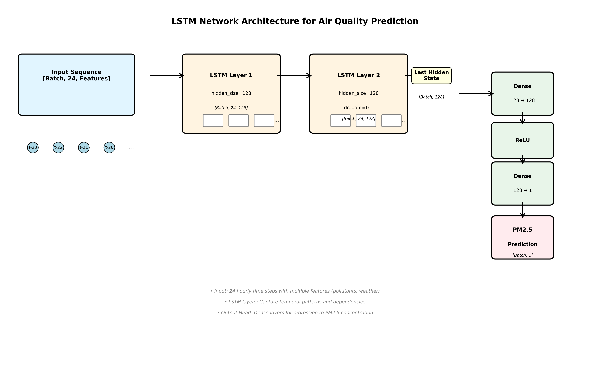
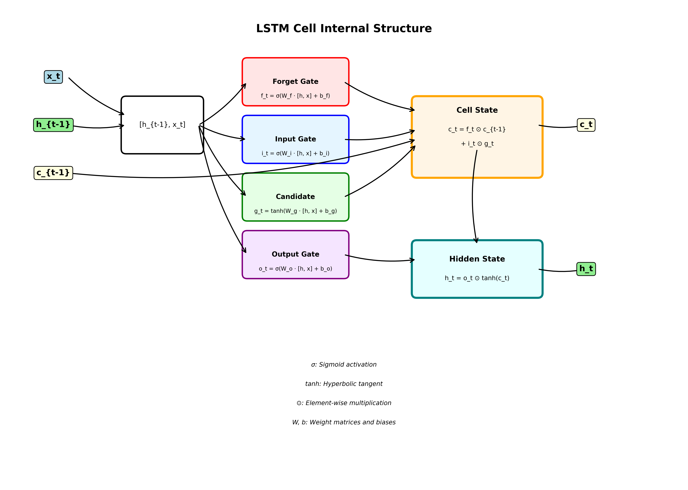
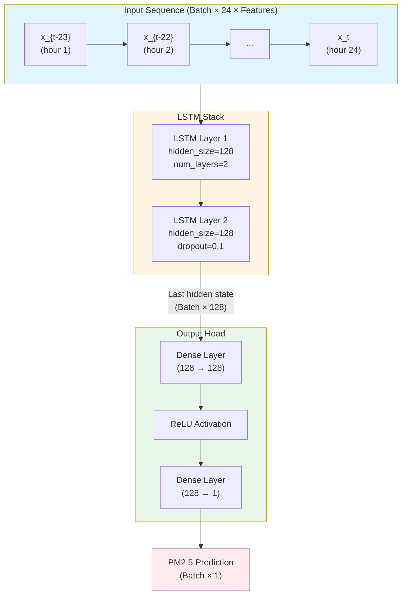

### 3.3 LSTM Model Theory

Long Short-Term Memory (LSTM) networks are a specialized recurrent neural network (RNN) architecture designed to model long-range temporal dependencies while effectively mitigating the vanishing and exploding gradient problems that plague standard RNNs. Developed by Hochreiter and Schmidhuber in 1997, LSTMs excel at learning patterns in sequential data by maintaining a persistent memory state that can retain information over extended time periods.

#### Core Components

Each LSTM cell maintains two internal states:

- **Cell state (c_t)**: The long-term memory that flows through the network relatively unchanged
- **Hidden state (h_t)**: The working memory that is exposed as output and influences predictions

The LSTM cell employs three gated mechanisms to control information flow:

1. **Forget Gate (f_t)**: Determines which information from the previous cell state should be discarded. It uses a sigmoid activation to produce values between 0 (completely forget) and 1 (completely retain).

2. **Input Gate (i_t)**: Decides which new information from the current input should be added to the cell state. It works in conjunction with the candidate state to selectively update memory.

3. **Output Gate (o_t)**: Controls how much of the cell state is exposed as the hidden state output. This allows the LSTM to selectively reveal information when making predictions.

#### Mathematical Formulation

Given an input sequence {x_1, x_2, ..., x_T}, at each time step t, the LSTM computes:

- **Forget gate**: f*t = σ(W_f · [h*{t-1}, x_t] + b_f)
- **Input gate**: i*t = σ(W_i · [h*{t-1}, x_t] + b_i)
- **Candidate state**: g*t = tanh(W_g · [h*{t-1}, x_t] + b_g)
- **Cell state update**: c*t = f_t ⊙ c*{t-1} + i_t ⊙ g_t
- **Output gate**: o*t = σ(W_o · [h*{t-1}, x_t] + b_o)
- **Hidden state**: h_t = o_t ⊙ tanh(c_t)

Where:

- σ denotes the sigmoid activation function
- ⊙ denotes element-wise multiplication
- W_f, W_i, W_g, W_o are weight matrices
- b_f, b_i, b_g, b_o are bias vectors
- [h_{t-1}, x_t] represents concatenation of the previous hidden state and current input

#### Advantages for Air Quality Prediction

The gating mechanism enables LSTMs to:

- **Capture temporal patterns**: Learn daily and weekly cycles in air quality measurements
- **Handle long-range dependencies**: Remember relevant information from hours or days earlier
- **Integrate multi-scale features**: Combine short-term fluctuations with long-term trends and seasonal patterns
- **Adapt to changing conditions**: Selectively forget outdated information and incorporate new meteorological or pollution signals
- **Model non-linear relationships**: Capture complex interactions between pollutant concentrations, weather variables, and spatial factors

This makes LSTMs particularly well-suited for air quality time series where periodicity (daily, weekly, seasonal), trends, and exogenous signals (temperature, wind, humidity) interact across multiple time scales.

### 3.4 Network Architecture Diagram

The LSTM model architecture is designed for multi-step ahead air quality forecasting. The network processes a sequence of 24 hourly time steps containing multiple features (air pollutants, meteorological variables) and predicts the PM2.5 concentration for the next hour.

#### Architecture Overview

The following diagram illustrates the complete LSTM network architecture:

_Figure: Complete LSTM network architecture for air quality prediction. The network processes 24 hourly time steps of multi-feature input data through two stacked LSTM layers, then uses a dense output head to predict PM2.5 concentration._

Additionally, the internal structure of an LSTM cell is shown below:

_Figure: Internal structure of an LSTM cell showing the gating mechanisms (forget gate, input gate, output gate) and how information flows through the cell state and hidden state._

The architecture can also be represented in Mermaid format:

#### Detailed Layer Specifications

1. **Input Layer**:

   - Shape: `[Batch, 24, Features]`
   - Features include: PM2.5, PM10, SO2, NO2, CO, O3, temperature, pressure, dew point, wind speed, wind direction, and station identifiers (normalized)

2. **LSTM Layer 1**:

   - Hidden size: 128 units
   - Processes the input sequence and captures temporal patterns
   - Output shape: `[Batch, 24, 128]`

3. **LSTM Layer 2**:

   - Hidden size: 128 units
   - Dropout: 0.1 (applied between layers)
   - Extracts higher-level temporal abstractions
   - Output shape: `[Batch, 24, 128]`

4. **Sequence Pooling**:

   - Takes the last hidden state from the sequence: `[Batch, 128]`
   - This aggregates information from all 24 input time steps

5. **Output Head (MLP)**:
   - Dense layer 1: 128 → 128 with ReLU activation
   - Dense layer 2: 128 → 1 (linear output for regression)
   - Final output: `[Batch, 1]` - predicted PM2.5 value

#### Training Configuration

The model was trained with the following hyperparameters:

- **Input sequence length**: 24 hours (one day of hourly data)
- **Output horizon**: 1 hour ahead (single-step prediction)
- **Batch size**: 128 samples per batch
- **Learning rate**: 1e-3 (0.001)
- **Optimizer**: Adam (adaptive learning rate)
- **Loss function**: Mean Squared Error (MSE)
- **Epochs**: 20
- **Regularization**:
  - Dropout rate: 0.1 between LSTM layers
  - Data standardization: Z-score normalization per feature
- **Train/Validation split**: 80/20 (temporal split, last 20% for validation)

#### Training Results

After 20 epochs of training, the model achieved:

- **Final training MSE**: 0.035069
- **Final validation MSE**: 0.044785
- **Model saved**: `air_quality_prediction/models/lstm_model.pt`

The validation loss closely tracks the training loss, indicating good generalization without overfitting. The model successfully learned temporal patterns in the air quality data across multiple monitoring stations.
